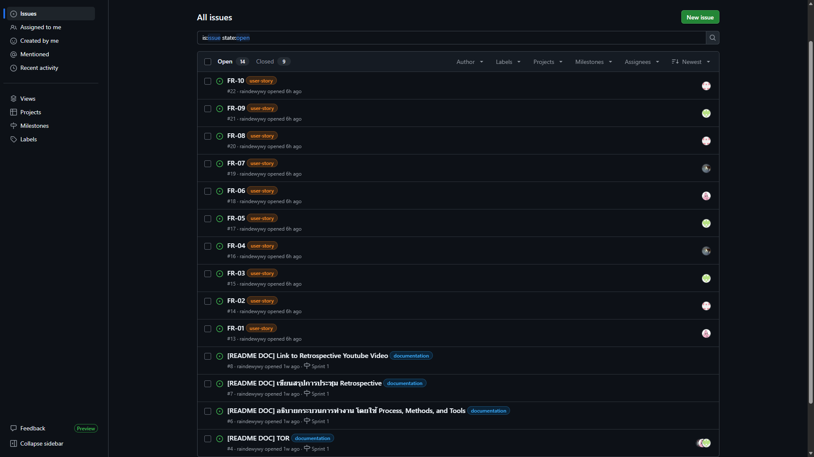
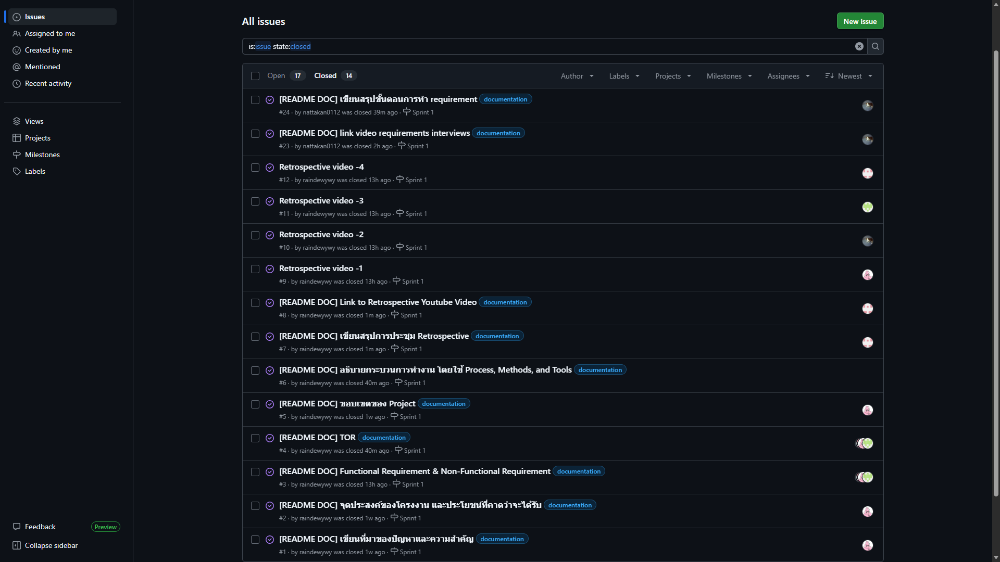
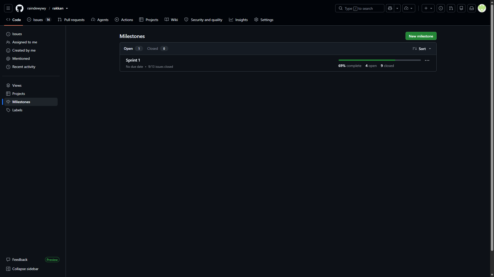
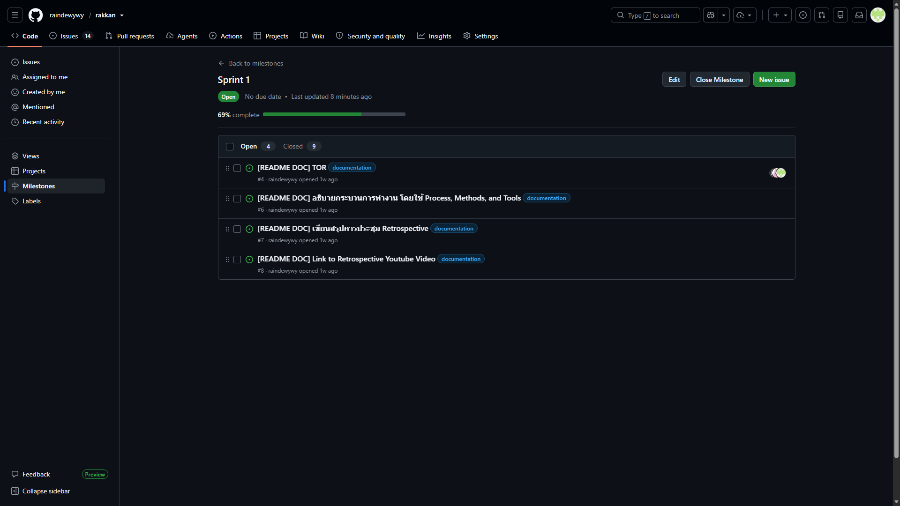
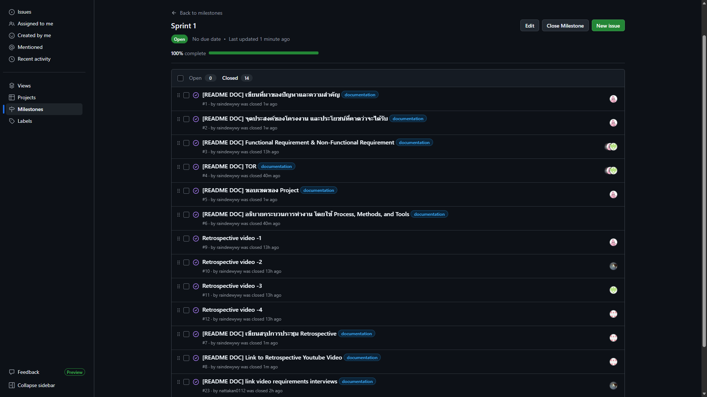

# Fortune Telling Web Application

เว็บแอปพลิเคชันสำหรับการดูดวงออนไลน์ โดยผู้ใช้สามารถกรอกข้อมูลวันเกิดและเลือกประเภทการดูดวง เพื่อรับคำทำนายและคำแนะนำในรูปแบบที่เข้าใจง่าย โดยระบบพัฒนาในรูปแบบ **Frontend-only Web Application** ไม่มีฐานข้อมูล และสามารถนำไป Deploy บน GitHub Pages ได้

---

## 1. สมาชิกกลุ่ม

| ลำดับ | ชื่อ-นามสกุล                 |รหัสนิสิต   |
| ----- | ---------------------------- |----------- |
| 1     | นางสาวณัฏฐกานต์ สุริยะศรี    |68102010198 |
| 2     | นายธราธร การนา               |68102010204 |
| 3     | นางสาวชยาภา สุวรรณจินดา      |68102010294 |
| 4     | นางสาวสุรีย์รัตน์ หงษ์กำเนิด |68102010563 |

---

# 2. ที่มาของปัญหาและความสำคัญ

ในปัจจุบันการดูดวงเป็นกิจกรรมที่ได้รับความสนใจจากผู้คนหลากหลายกลุ่ม โดยเฉพาะการดูดวงเกี่ยวกับเรื่องความรัก การงาน การเงิน และการเรียน อย่างไรก็ตาม การเข้าถึงคำทำนายในบางรูปแบบอาจมีขั้นตอนที่ซับซ้อน หรือผู้ใช้ต้องค้นหาข้อมูลจากหลายแหล่ง

กลุ่มผู้จัดทำจึงมีแนวคิดในการพัฒนา **Fortune Telling Web Application** เพื่อเป็นเว็บแอปพลิเคชันที่ช่วยให้ผู้ใช้สามารถดูคำทำนายได้อย่างสะดวก โดยมีขั้นตอนการใช้งานที่ไม่ซับซ้อน ตั้งแต่การกรอกวันเกิด การเลือกประเภทการดูดวง ไปจนถึงการแสดงผลคำทำนายและคำแนะนำ

โครงการนี้มุ่งเน้นการพัฒนา Web Application ตามกระบวนการ Software Development Life Cycle (SDLC) และแนวคิด Scrum โดยเริ่มต้นจากการเก็บรวบรวมและวิเคราะห์ความต้องการของผู้ใช้จริงก่อนนำไปพัฒนาระบบ

---

# 3. จุดประสงค์ของ Project

1. เพื่อพัฒนาเว็บแอปพลิเคชันสำหรับการดูดวงที่ใช้งานง่าย
2. เพื่อให้ผู้ใช้สามารถกรอกข้อมูลวันเกิดและรับคำทำนายได้
3. เพื่อให้ผู้ใช้สามารถเลือกประเภทของการดูดวงตามความสนใจ
4. เพื่อแสดงคำทำนายและคำแนะนำในรูปแบบที่เข้าใจง่าย
5. เพื่อฝึกกระบวนการพัฒนาซอฟต์แวร์ตั้งแต่การเก็บ Requirement จนถึงการ Deploy
6. เพื่อประยุกต์ใช้ GitHub ในการจัดการ Source Code, Issue, Product Backlog และ Sprint Backlog
7. เพื่อฝึกการทำงานร่วมกันเป็นทีมด้วยแนวคิด Scrum และการแบ่งงานตาม Sprint

---

# 4. ประโยชน์ที่คาดว่าจะได้รับ

* ผู้ใช้สามารถเข้าถึงคำทำนายได้ง่ายและสะดวก
* ลดขั้นตอนในการค้นหาคำทำนายจากหลายแหล่ง
* ผู้ใช้สามารถเลือกหัวข้อการดูดวงที่สนใจได้
* ผู้ใช้ได้รับคำแนะนำประกอบคำทำนาย
* สมาชิกในกลุ่มได้ฝึกกระบวนการพัฒนา Web Application
* สมาชิกได้ฝึกการทำงานร่วมกันผ่าน GitHub และ Scrum
* สามารถนำระบบไปใช้งานผ่าน GitHub Pages ได้

---

# 5. ขอบเขตของ Project

## 5.1 สิ่งที่ระบบสามารถทำได้

1. แสดงหน้าแรกของระบบ
2. แสดงรายละเอียดและคำอธิบายของระบบ
3. ให้ผู้ใช้กรอกข้อมูลวันเกิด
4. ตรวจสอบความถูกต้องของข้อมูลที่ผู้ใช้กรอก
5. ให้ผู้ใช้เลือกประเภทการดูดวง
6. ประมวลผลข้อมูลตาม Fortune Algorithm ที่กำหนด
7. แสดงผลคำทำนาย
8. แสดงคำแนะนำที่เกี่ยวข้องกับคำทำนาย
9. ให้ผู้ใช้เริ่มการดูดวงใหม่
10. รองรับการใช้งานบนอุปกรณ์ที่มีขนาดหน้าจอแตกต่างกัน

## 5.2 ประเภทการดูดวง

ระบบเบื้องต้นรองรับประเภทการดูดวงดังต่อไปนี้

* ความรัก (Love)
* การงาน (Career)
* การเงิน (Finance)
* การเรียน (Education)
* ภาพรวมชีวิต (Overview)

## 5.3 สิ่งที่ระบบไม่ครอบคลุม

* ไม่มีระบบสมัครสมาชิก
* ไม่มีระบบ Login / Logout
* ไม่มีระบบชำระเงิน
* ไม่มีระบบฐานข้อมูล
* ไม่มีระบบจัดเก็บประวัติการดูดวงถาวร
* ไม่มีระบบแชตกับหมอดู
* ไม่มีระบบเชื่อมต่อกับผู้ให้บริการดูดวงภายนอก
* คำทำนายเป็นข้อมูลเพื่อความบันเทิงและแนวทางทั่วไป ไม่ใช่คำแนะนำทางวิชาชีพ

---

# 6. Functional Requirements

| ID    | รายละเอียด                                                 
| ----- | ---------------------------------------------------------- 
| FR-01 | ระบบต้องแสดงหน้าแรกและข้อมูลแนะนำเว็บไซต์
| FR-02 | ระบบต้องให้ผู้ใช้เลือกประเภทการดูดวงได้
| FR-03 | ผู้ใช้สามารถเลือกวัน/เดือน/ปีเกิดจากปฏิทิน
| FR-04 | ระบบตรวจสอบว่าข้อมูลที่กรอกถูกต้องและครบถ้วน
| FR-05 | ระบบต้องแสดง error message เมื่อข้อมูลที่กรอกไม่ครบหรือไม่ถูกต้อง
| FR-06 | ระบบนำข้อมูลผู้ใช้ไปประมวลผลคำทำนายตาม Fortune Algorithm
| FR-07 | ระบบเลือกคำทำนายตามผลการประมวลผล
| FR-08 | ระบบแสดงผลคำทำนายให้ผู้ใช้
| FR-09 | ระบบแสดงคำแนะนำที่เกี่ยวข้องกับผลการดูดวง
| FR-10 | ผู้ใช้สามารถเริ่มดูดวงใหม่ได้

---

# 7. Non-Functional Requirements

| ID    | รายละเอียด                                                 
| ----- | ---------------------------------------------------------- 
| NFR-01 | หน้าเว็บควรโหลดและตอบสนองต่อการใช้งานอย่างรวดเร็ว
| NFR-02 | เว็บไซต์ต้องรองรับ Mobile, Tablet และ Desktop                    
| NFR-03 | เว็บไซต์ต้องทำงานบน Chrome, Edge, Firefox และ Safari รุ่นปัจจุบันที่รองรับ                
| NFR-04 | ระบบต้องไม่จัดเก็บข้อมูลส่วนตัวของผู้ใช้บน Server       
| NFR-05 | ข้อมูลที่ผู้ใช้กรอกต้องถูกประมวลผลภายใน Browser และไม่ส่งไปยัง Database        
| NFR-06 | โครงสร้างระบบควรสามารถเพิ่มประเภทการดูดวงและคำทำนายได้โดยไม่ต้องเปลี่ยนโครงสร้างหลัก 
| NFR-07 | ระบบต้องไม่ล่มเมื่อผู้ใช้กรอกข้อมูลไม่ครบ                            

---

# 8. ข้อกําหนดคุณสมบัติเว็บไซต์ดูดวงออนไลน์

## 8.1. ระบบแสดงผลสําหรับผู้ใช้งาน (Front-End)

เว็บไซต์ต้องมีส่วนติดต่อผู้ใช้งานผ่าน Web Browser โดยมีคุณสมบัติดังนี้

### 8.1.1 หน้าแรก

ระบบต้องมีหน้าแรกสําหรับแนะนําเว็บไซต์และบริการดูดวง โดยแสดงข้อมูลที่จําเป็น เช่น

* ชื่อเว็บไซต์
* รายละเอียดหรือคําแนะนําเกี่ยวกับเว็บไซต์
* รายละเอียดเกี่ยวกับการดูดวง
* เมนูเข้าสู่การดูดวง
* ส่วนแสดงข้อมูลหรือคําแนะนําที่เกี่ยวข้อง

### 8.1.2 ระบบเลือกประเภทการดูดวง

ระบบต้องให้ผู้ใช้งานสามารถเลือกประเภทของการดูดวงที่ต้องการได้ เช่น

* ดูดวงตามวันเกิด
* ดูดวงด้านความรัก
* ดูดวงด้านการงาน
* ดูดวงด้านการเงิน
* หรือประเภทอื่นตามที่ระบบกําหนด

โครงสร้างระบบควรออกแบบให้สามารถเพิ่มประเภทการดูดวงเพิ่มเติมในอนาคตได้โดยไม่จําเป็นต้องปรับเปลี่ยนโครงสร้าง
หลักของระบบ

### 8.1.3 ระบบกรอกข้อมูลวันเกิด

ระบบต้องให้ผู้ใช้งานเลือก

* วันเกิด
* เดือนเกิด
* ปีเกิด

โดยควรใช้รูปแบบปฏิทิน (Date Picker/Calendar) เพื่อช่วยลดความผิดพลาดในการกรอกข้อมูล

### 8.1.4 ระบบตรวจสอบข้อมูล

ระบบต้องตรวจสอบข้อมูลก่อนนําไปประมวลผล ได้แก่

* ตรวจสอบว่ามีการระบุวันเกิด
* ตรวจสอบว่ามีการระบุเดือนเกิด
* ตรวจสอบว่ามีการระบุปีเกิด
* ตรวจสอบว่าข้อมูลอยู่ในรูปแบบที่ถูกต้อง
* ตรวจสอบวันที่ที่ไม่มีอยู่จริง

หากข้อมูลไม่ครบถ้วนหรือไม่ถูกต้อง ระบบต้องไม่ดําเนินการประมวลผลคําทํานาย

### 8.1.5 ระบบแสดงข้อความแจ้งเตือน

เมื่อผู้ใช้งานกรอกข้อมูลไม่ครบถ้วนหรือไม่ถูกต้อง ระบบต้องแสดง Error Message เพื่อแจ้งให้ผู้ใช้งานทราบถึงข้อมูลที่ต้องแก้ไข

ตัวอย่างเช่น

กรุณาระบุวันเกิด หรือกรุณาตรวจสอบข้อมูลวันเดือนปีเกิด

## 8.2. ระบบประมวลผลคําทํานาย

### 8.2.1 Fortune Algorithm

ระบบต้องนําข้อมูลที่ผู้ใช้งานกรอกเข้าสู่กระบวนการประมวลผลด้วย Fortune Algorithm กระบวนการทํางานโดยสรุปคือ

* ข้อมูลวันเดือนปีเกิด
* ตรวจสอบความถูกต้องของข้อมูล
* Fortune Algorithm
* ผลการประมวลผล
* เลือกคําทํานายที่ตรงกับผลลัพธ์
* แสดงคําแนะนําที่เกี่ยวข้อง

ระบบต้องสามารถแยกส่วนของ Algorithm ออกจากส่วนแสดงผล เพื่อให้สามารถปรับปรุงหรือเพิ่มรูปแบบคําทํานายได้ในอนาคต

### 8.2.2 การเลือกคําทํานาย

ระบบต้องสามารถนําผลลัพธ์จาก Fortune Algorithm ไปใช้ในการเลือกคําทํานายที่ตรงกับผลการประมวลผล

คําทํานายอาจประกอบด้วยข้อมูล เช่น

* ผลการดูดวง
* คําอธิบาย
* ระดับหรือคะแนน
* คําทํานายด้านต่าง ๆ
* คําแนะนํา

### 8.2.3 การแสดงผลคําทํานาย

ระบบต้องแสดงผลคําทํานายให้ผู้ใช้งานเข้าใจได้ง่าย โดยอาจประกอบด้วย

* ผลการดูดวง
* รายละเอียดคําทํานาย
* คําทํานายด้านความรัก
* คําทํานายด้านการงาน
* คําทํานายด้านการเงิน
* คําแนะนําเพิ่มเติม

ทั้งนี้รายละเอียดของผลการดูดวงให้เป็นไปตามประเภทการดูดวงที่ผู้ใช้งานเลือก

### 8.2.4 คําแนะนําที่เกี่ยวข้อง

ระบบต้องสามารถแสดงคําแนะนําที่สัมพันธ์กับผลการดูดวง เช่น

* คําแนะนําในการดําเนินชีวิต
* คําแนะนําด้านการงาน
* คําแนะนําด้านความรัก
* คําแนะนําด้านการเงิน

โดยคําแนะนําต้องสอดคล้องกับผลลัพธ์ที่ได้จาก Fortune Algorithm

## 8.3. ระบบเริ่มดูดวงใหม่

ระบบต้องมีฟังก์ชันสําหรับให้ผู้ใช้งานสามารถเริ่มต้นการดูดวงใหม่ได้ เช่น

ดูดวงอีกครั้ง / ดูดวงใหม่

เมื่อผู้ใช้งานเลือกฟังก์ชันดังกล่าว ระบบต้องกลับไปยังขั้นตอนการเลือกประเภทการดูดวงหรือกรอกข้อมูลวันเกิด เพื่อให้สามารถดําเนินการดูดวงครั้งใหม่ได้

## 8.4. การออกแบบระบบ

ผู้รับจ้างต้องออกแบบระบบให้มีโครงสร้างที่เหมาะสมต่อการพัฒนาและบํารุงรักษา โดยอย่างน้อยต้องประกอบด้วย

### 8.4.1 ส่วน User Interface

ประกอบด้วย

1. หน้าแรก
2. หน้าเลือกประเภทการดูดวง
3. หน้ากรอกวันเดือนปีเกิด
4. หน้าแสดงผลการดูดวง
5. หน้าหรือส่วนแสดงคําแนะนํา
6. ฟังก์ชันสําหรับเริ่มดูดวงใหม่

### 8.4.2 ส่วน Fortune Algorithm

ต้องแยกส่วนการประมวลผลออกจาก User Interface เพื่อให้สามารถ

* แก้ไข Algorithm ได้
* เพิ่มประเภทการดูดวงได้
* เพิ่มคําทํานายได้
* ปรับปรุงผลลัพธ์ได้

โดยไม่กระทบต่อโครงสร้างหลักของเว็บไซต์

### 8.4.3 ส่วนข้อมูลคําทํานาย

ควรออกแบบข้อมูลคําทํานายให้สามารถเพิ่ม แก้ไข หรือลบข้อมูลได้โดยง่าย และสามารถรองรับคําทํานายหลายประเภท

### 8.4.4 ความปลอดภัยและการคุ้มครองข้อมูล

เนื่องจากเว็บไซต์ใช้ข้อมูลวันเดือนปีเกิดของผู้ใช้งาน ระบบต้องออกแบบให้ข้อมูลดังกล่าวถูกใช้เฉพาะสําหรับการประมวลผลคําทํานาย

โดยมีข้อกําหนดดังนี้

1. ไม่จัดเก็บข้อมูลวันเดือนปีเกิดลง Database
2. ไม่ส่งข้อมูลไปยัง Server เพื่อประมวลผล
3. ประมวลผลข้อมูลภายใน Browser ของผู้ใช้งาน
4. เมื่อผู้ใช้งานออกจากหน้าดูดวง ข้อมูลที่ใช้ประมวลผลต้องไม่ถูกเก็บไว้เป็นข้อมูลถาวร
5. ระบบต้องไม่สร้างบัญชีผู้ใช้งานเพื่อให้บริการดูดวง เว้นแต่มีการกําหนดเพิ่มเติมในภายหลัง

### 8.4.5 การรองรับอุปกรณ์

เว็บไซต์ต้องออกแบบเป็น Responsive Web Application เพื่อให้สามารถใช้งานได้บน

* Desktop / PC
* Laptop
* Tablet
* Smartphone

หน้าจอและองค์ประกอบต่าง ๆ ต้องสามารถปรับขนาดให้เหมาะสมกับอุปกรณ์แต่ละประเภท โดยไม่ทําให้ข้อมูลหรือฟังก์ชันหลักของระบบสูญหาย

### 8.4.6 การรองรับ Web Browser

ระบบต้องสามารถใช้งานบน Web Browser รุ่นปัจจุบันที่ยังได้รับการสนับสนุน ได้แก่

1. Google Chrome
2. Microsoft Edge
3. Mozilla Firefox
4. Safari
   
## 8.5. การทดสอบระบบ

ผู้รับจ้างต้องดําเนินการทดสอบระบบก่อนส่งมอบ โดยอย่างน้อยต้องครอบคลุม

### 8.5.1 Functional Testing

ทดสอบว่า FR-01 ถึง FR-10 สามารถทํางานได้ตามข้อกําหนด

### 8.5.2 Validation Testing

ทดสอบกรณี

* ไม่กรอกวันเกิด
* ไม่กรอกเดือนเกิด
* ไม่กรอกปีเกิด
* กรอกข้อมูลไม่ถูกต้อง
* กรอกข้อมูลครบถ้วนและถูกต้อง

### 8.5.3 Responsive Testing

ทดสอบการแสดงผลบน

* Desktop
* Tablet
* Mobile

### 8.5.4 Browser Testing

ทดสอบบน Chrome, Edge, Firefox และ Safari

### 8.5.5 Error Handling Testing

ตรวจสอบว่าระบบสามารถจัดการกรณีผู้ใช้งานกรอกข้อมูลผิดหรือไม่ครบ โดย ไม่ทําให้ระบบล่ม

---

# 9\. กระบวนการทำงาน (Process, Methods, and Tools)

## 9.1 กระบวนการพัฒนา (Development Process)

โครงการนี้พัฒนาตามแนวคิด Agile/Scrum ควบคู่กับ Software Development Life Cycle (SDLC) โดยแบ่งการทำงานเป็นรอบ (Sprint) แต่ละรอบประกอบด้วย:

1. Requirement Gathering — สัมภาษณ์เพื่อนนอกกลุ่มเพื่อเก็บ Requirement จริง พร้อมอัดวิดีโอประกอบ  
2. Requirement Analysis — วิเคราะห์สิ่งที่ได้จากการสัมภาษณ์ แล้วแปลงเป็น Functional/Non-Functional Requirement และ User Story  
3. Product Backlog Creation — นำ User Story มาสร้างเป็น GitHub Issues เพื่อเป็น Product Backlog ของโครงการ  
4. Sprint Planning — เลือก Issue ที่จะทำใน Sprint นั้น ๆ มาจัดเป็น Milestone (เช่น Sprint 1\)  
5. Implementation — ลงมือพัฒนา/เขียนงานตาม Issue ที่ได้รับมอบหมาย  
6. Sprint Review — ตรวจสอบผลงานเทียบกับ Acceptance Criteria ของแต่ละ Issue  
7. Sprint Retrospective — ทีมประชุมทบทวนสิ่งที่ทำได้ดีและสิ่งที่ควรปรับปรุง พร้อมอัดวิดีโอสรุปผล

## 9.2 เครื่องมือที่ใช้ (Tools)

| เครื่องมือ | วัตถุประสงค์การใช้งาน |
| :---- | :---- |
| GitHub (Issues, Milestones, Projects) | จัดการ Source Code, Product Backlog, Sprint Backlog |
| GitHub Pages | Deploy เว็บแอปพลิเคชัน |
| VS Code | เขียนโค้ด (HTML/CSS/JavaScript) |
| Git | Version Control |
| *Discord / Line* | ประชุมทีมและสัมภาษณ์เก็บ Requirement |
| *Figma* | ออกแบบหน้าตาเว็บไซต์ (ถ้ามี) |
| YouTube | เผยแพร่วิดีโอสัมภาษณ์ Requirement และวิดีโอ Retrospective |

## 9.3 วิธีการทำงานร่วมกันของทีม (Team Working Method)

- ใช้ GitHub Issues แทน To-do list ของแต่ละคน แบ่งงานตามความถนัด  
- ติดตามความคืบหน้าผ่าน Milestone "Sprint 1" ใน GitHub  
- แต่ละ Issue มีการระบุรายละเอียดงาน (Description) และ Label กำกับประเภทงาน (เช่น documentation, user-story)

---

# 10. Product Backlog และ Sprint Backlog

## 10.1 Product Backlog

**คำอธิบาย:** Product Backlog คือรายการงานทั้งหมดของโครงการ ครอบคลุมทั้งงานด้านเอกสาร/การวางแผน (Documentation Tasks), งานบันทึกวิดีโอ (Tasks) และรายการความต้องการของระบบในรูปแบบ User Story ทีมใช้ **GitHub Issues** ในการติดตามสถานะ โดยรายการงานจะถูกเลือกเข้าสู่ Sprint Backlog ผ่านระบบ **Milestone** ในแต่ละรอบ Sprint Planning

**ภาพหน้าจอ Product Backlog (GitHub Issues):**

**รายการ Product Backlog ทั้งหมด (จาก GitHub Issues):**

| # | Issue / Requirement | ประเภท | Label | Milestone | สถานะ |
| :---: | :--- | :---: | :---: | :---: | :---: |
| **#1** | เขียนที่มาของปัญหาและความสำคัญ | Documentation | `documentation` | Sprint 1 | Closed |
| **#2** | จุดประสงค์ของโครงงาน และประโยชน์ที่คาดว่าจะได้รับ | Documentation | `documentation` | Sprint 1 | Closed |
| **#3** | Functional Requirement & Non-Functional Requirement | Documentation | `documentation` | Sprint 1 | Closed |
| **#4** | TOR | Documentation | `documentation` | Sprint 1 | Open |
| **#5** | ขอบเขตของ Project | Documentation | `documentation` | Sprint 1 | Closed |
| **#6** | อธิบายกระบวนการทำงาน โดยใช้ Process, Methods, and Tools | Documentation | `documentation` | Sprint 1 | Open |
| **#7** | เขียนสรุปการประชุม Retrospective | Documentation | `documentation` | Sprint 1 | Open |
| **#8** | Link to Retrospective Youtube Video | Documentation | `documentation` | Sprint 1 | Open |
| **#9** | Retrospective video -1 (ที่มา ปัญหา วัตถุประสงค์) | Task | – | Sprint 1 | Closed |
| **#10** | Retrospective video -2 (ขอบเขตของ Project) | Task | – | Sprint 1 | Closed |
| **#11** | Retrospective video -3 (Functional Requirements) | Task | – | Sprint 1 | Closed |
| **#12** | Retrospective video -4 (Non-Functional Requirements) | Task | – | Sprint 1 | Closed |
| **#13** | FR-10: รีสตาร์ตกระบวนการดูดวงใหม่ (Restart Fortune Process) | User Story | `user-story` | *[รอกำหนด]* | Open |
| **#14** | FR-9: แสดงคำแนะนำที่เกี่ยวข้องกับคำทำนาย (Recommendations) | User Story | `user-story` | *[รอกำหนด]* | Open |
| **#15** | FR-8: แสดงผลคำทำนายบนหน้าจอ (Display Prediction) | User Story | `user-story` | *[รอกำหนด]* | Open |
| **#16** | FR-7: คัดเลือกคำทำนายตามผลการคำนวณ (Match Prediction) | User Story | `user-story` | *[รอกำหนด]* | Open |
| **#17** | FR-6: ประมวลผลข้อมูลผ่าน Fortune Algorithm | User Story | `user-story` | *[รอกำหนด]* | Open |
| **#18** | FR-5: แสดง Error Message เมื่อข้อมูลไม่ถูกต้องหรือไม่ครบถ้วน | User Story | `user-story` | *[รอกำหนด]* | Open |
| **#19** | FR-4: ตรวจสอบความครบถ้วนถูกต้องของข้อมูล (Input Validation) | User Story | `user-story` | *[รอกำหนด]* | Open |
| **#20** | FR-3: กรอกวันเดือนปีเกิดผ่าน Calendar Picker | User Story | `user-story` | *[รอกำหนด]* | Open |
| **#21** | FR-2: เลือกประเภทการดูดวง (Love, Career, Finance, etc.) | User Story | `user-story` | *[รอกำหนด]* | Open |
| **#22** | FR-1: หน้าแรกและคำอธิบายเว็บไซต์ (Homepage & Intro) | User Story | `user-story` | *[รอกำหนด]* | Open |
| **#23** | video requirements interviews (สัมภาษณ์เพื่อเก็บข้อมูล Requirements) | Documentation | `documentation` | Sprint 1 | Closed |

---

## 10.2 Sprint Backlog (Sprint 1)

**คำอธิบาย:** Sprint Backlog คือชุดของ Issue ที่ทีมเลือกมาจาก Product Backlog เพื่อดำเนินงานให้เสร็จสิ้นภายในกรอบเวลาของ Sprint 1 โดยใน GitHub จัดการผ่าน Milestone **"Sprint 1"** ซึ่งในรอบนี้เน้นการวิเคราะห์ความต้องการ (Requirement Gathering), การกำหนดขอบเขตโครงงาน, การจัดทำเอกสารรายงาน (Documentation) และการจัดทำ Retrospective เพื่อเตรียมความพร้อมก่อนเข้าสู่รอบการพัฒนาโค้ดจริง

**ภาพหน้าจอ Sprint Backlog (GitHub Milestone "Sprint 1"):**

*ภาพหน้าจอ Milestone "Sprint 1" แสดง Progress Bar และรายการ Issue ทั้งหมดที่ถูกผูกไว้กับ Sprint 1*

**รายละเอียด Sprint 1:**

| หัวข้อ | รายละเอียด |
| :--- | :--- |
| **ชื่อ Sprint** | Sprint 1 |
| **ระยะเวลา** | 3 กันยายน 2026 – *ยังไม่กำหนดวันสิ้นสุด* |
| **เป้าหมายของ Sprint (Sprint Goal)** | วิเคราะห์และกำหนดขอบเขต Requirements, จัดทำโครงร่าง Product Backlog/User Story ทั้งหมด, สรุปกระบวนการทำงานลงใน README.md และบันทึก Retrospective Video สะท้อนปัญหาและแนวทางแก้ไข |
| **Issues ใน Sprint 1** | **รวม 12 Issues:** • Documentation: #1, #2, #3, #4, #5, #6, #7, #8, #23 • Tasks/Video: #9, #10, #11, #12 |
| **ผลลัพธ์ที่คาดหวัง (Deliverables)** | 1. เอกสารรายงาน (README.md) หัวข้อ 1–10 ครบถ้วนสมบูรณ์ 2. วิดีโอคลิป Retrospective จำนวน 4 คลิปพร้อมลิงก์ YouTube 3. Product Backlog บน GitHub Issues ที่มี User Story (#13–#22) พร้อมสำหรับการวางแผนใน Sprint ถัดไป |

---
# สรุปขั้นตอนการทำ requirement
วันที่ 9/9/2569
ผู้ให้สัมภาษณ์: รุ่นพี่ในสาขา
หัวข้อหลัก: requirement ของผู้ใช้งาน

รายละเอียดภายในวิดีโอ
1. อยากให้ดูดวงวันเกิดได้
2. มีประเภทการดูดวงให้เลือก
3. มี tutorial ในการใช้งาน
4. ประเภทการดูดวง ได้แก่ ความรัก การเงิน สุขภาพ การเรียน
5. ข้อมูลต้องไม่ถูกจัดเก็บ
6.รับค่าวันเกิดเข้าผ่านการกรอกข้อมูลหรือเลือกจากปฏิทิน

https://youtu.be/lopJD8CxQZ0

* หมายเหตุ : เนื่องจากครั้งก่อนไม่ได้ถ่ายวิดีโอตอนสัมภาษณ์ไว้จึงได้มีการถ่ายย้อนหลัง
---

# สรุป Sprint Retrospective: Sprint 1

วันที่: 5/9/2569   
หัวข้อหลัก: การทบทวนการทำงานของ Sprint 1

รายละเอียดภายในวิดีโอ

1. การทำงานที่ทีมได้ดำเนินการใน Sprint 1 เราได้มีการเก็บ requirement และแบ่งงานให้แต่ละคนทำเป็นส่วนๆ 
2. ได้มีการสรุปที่มา ขอบเขต Functional Requirements และ Non-Functional Requirements
3. พูดคุยเกี่ยวกับปัญหาและอุปสรรคที่พบระหว่างการทำงาน
4. แนวทางในการปรับปรุงการทำงาน
5. สิ่งที่จะทำใน sprint ถัดไป

https://www.youtube.com/watch?v=AKPkHgnHAV8
